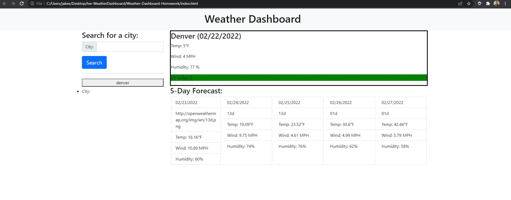

# Weather-Dashboard-Homework

This website allows the user to input any city they want and it will return a weather dashboard displaying the current city, date, temperature, windspeed, humidity percentage, and color coded uv index along with a 5-day forecast detailing the temperature, windspeed, and humidity percentage for the coming dates.

# Not the prettiest

I will be the first to admit that this one is not pretty at all. I struggled with local storage but I was able to get the history buttons to work on the left side. The icons were not working for me but it is currently 10:34 PM and I have been working purely on the local storage and the icons since I got out of class today and this is the best I've got.
I think the layout looks good for the most part. It could use some additional CSS styling but I ran out of time.

# Link to Deployed Application

https://jakeeis24.github.io/Weather-Dashboard-Homework/

# Screenshot

